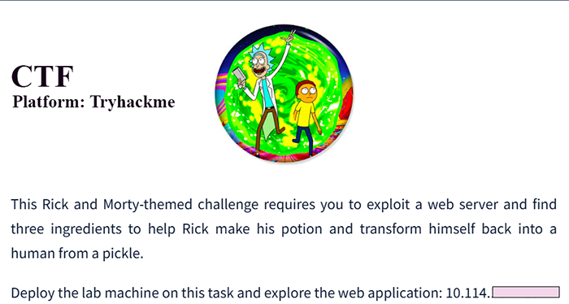
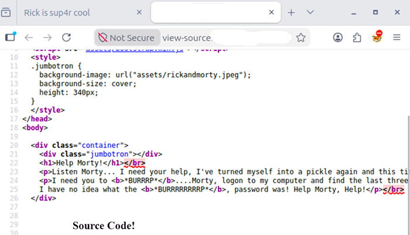
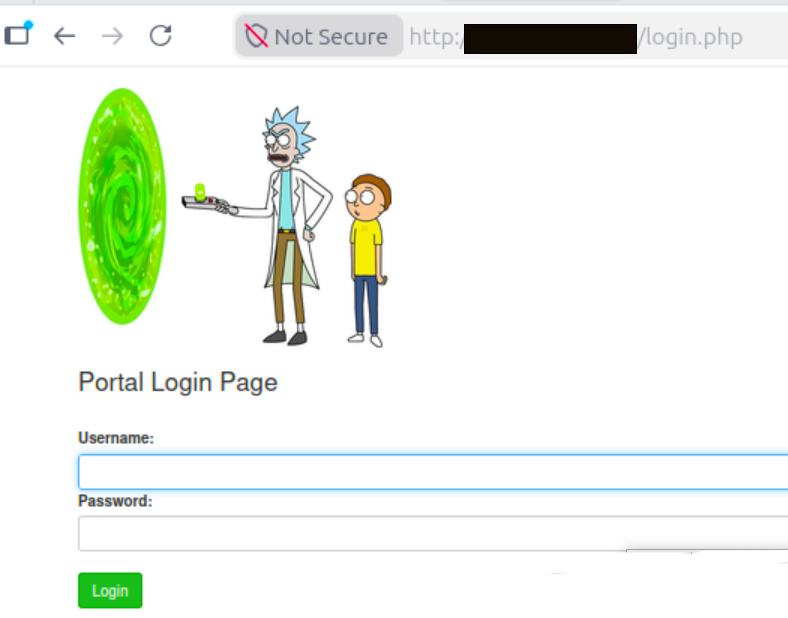

# Pickle Rick — TryHackMe

**Platform:** TryHackMe <br/>
**Difficulty:** Easy <br/>
**Category:** Web exploitation, Linux privilege escalation



## Summary

Pickle Rick is my first CTF which has an Easy-difficulty machine on TryHackMe.
The theme is about helping Rick to become again human through the search of the 3 ingredients.<br/> 
The search of these three hidden "ingredients" on the system involves web enumeration, file system exploration, and privilege escalation.

> Following TryHackMe's rules, this writeup does not include the actual flags/ingredients — the focus is on the methodology applied.

## Methodology

I followed a structured 5-phase Penetration Testing Process:<br/><br/> 
Reconnaissance.<br/> 
Scanning.<br/>
Enumeration.<br/> 
Exploitation.<br/>
Post-exploitation/privilege escalation.<br/>

### 1. Reconnaissance

Initial identification of the target and its attack surface through passive observation of the exposed web service.
In this challenge: we only have an ip address, so initially what can we do with it?.<br/>
Yes, look the source code perhaps we will find something.<br/><br/>


### 2. Enumeration

In my case, I applied theoretical knowledge of common web application structures to manually guess and test likely file and directory names. Many web applications follow predictable conventions, so I tried paths such as:<br/>

<strong>/robots.txt</strong> — a common file that can reveal directories.

<strong>/login.php</strong> — a typical entry point for applications with authentication.

<strong>/assets</strong> — a common folder name for static resources (images, CSS, JS).

<strong>index.html</strong> — reviewed its source code directly in the browser for comments or hints.

This manual, knowledge-based enumeration approach confirmed several existing files and directories on the server, including a PHP endpoint that allowed command execution — which opened the door to the exploitation phase.



<strong>Note</strong>:<br/>
 In a real-world or more complex engagement, this manual approach would normally be complemented with automated tools like nmap (for port/service discovery) and gobuster or dirb (for directory brute-forcing), which are faster and more thorough than manual guessing.<br/><br/>
 For this challenge, manual enumeration based on common conventions was sufficient.


### 4. Exploitation

Using the vulnerable endpoint identified during the enumeration phase, I was able to execute commands on the underlying operating system, gaining access as the `www-data` user (the default Apache web server user).

With access to a basic shell, I began exploring the file system:

```
pwd
ls -la
```

The first ingredient was found in a file with an obfuscated name inside the web directory (`/var/www/html`), reinforcing the importance of thoroughly reviewing all files, including ones with unconventional names.

### 5. Post-Exploitation / Privilege Escalation

**Exploring system users:**

I identified that an additional user existed on the system by checking the `/home` directory:

```
ls -la /home
```

This revealed the existence of the user `rick`, whose home directory contained the second ingredient.

**Technical lesson:** the file name contained a space, which required handling the path correctly:

```
less "/home/rick/second ingredients"
```

**Escalating to root:**

I checked the `sudo` privileges available to the current user:

```
sudo -l
```

The result showed `(ALL) NOPASSWD: ALL` permissions, indicating I could run any command as root without needing a password.

I initially tried to obtain an interactive shell with `sudo bash`, but the session did not reflect the expected user change. The effective alternative was running individual commands directly with `sudo`:

```
sudo whoami
```

This confirmed access as `root`. When attempting to read the final file with `cat`, I found that the command was disabled in this specific context (`sudo cat` returned "command disabled"). I used an alternative command to achieve the same goal:

```
sudo less /root/3rd.txt
```

This allowed access to the third and final ingredient, completing the machine.

## Lessons learned

- The distinction between the reconnaissance and scanning phases, and why `nmap` formally belongs to scanning rather than passive reconnaissance
- Handling file names with spaces in the Linux terminal (quotes or escaping with `\`)
- The importance of not assuming a single command (`cat`) will always work — some machines intentionally disable specific commands, so it's worth having alternatives ready (`less`, `more`, `head`, `tail`)
- `sudo -l` is a critical step in the privilege escalation phase to identify quick paths to root
- `sudo <interactive program>` doesn't always behave as expected in certain environments; running individual commands with `sudo` is a reliable alternative

## Tools used

- Web browser — application enumeration
- Linux terminal — `ls`, `cd`, `pwd`, `cat`, `less`, `whoami`, `sudo`

## Challenge Solved
Here the challenge solved:


